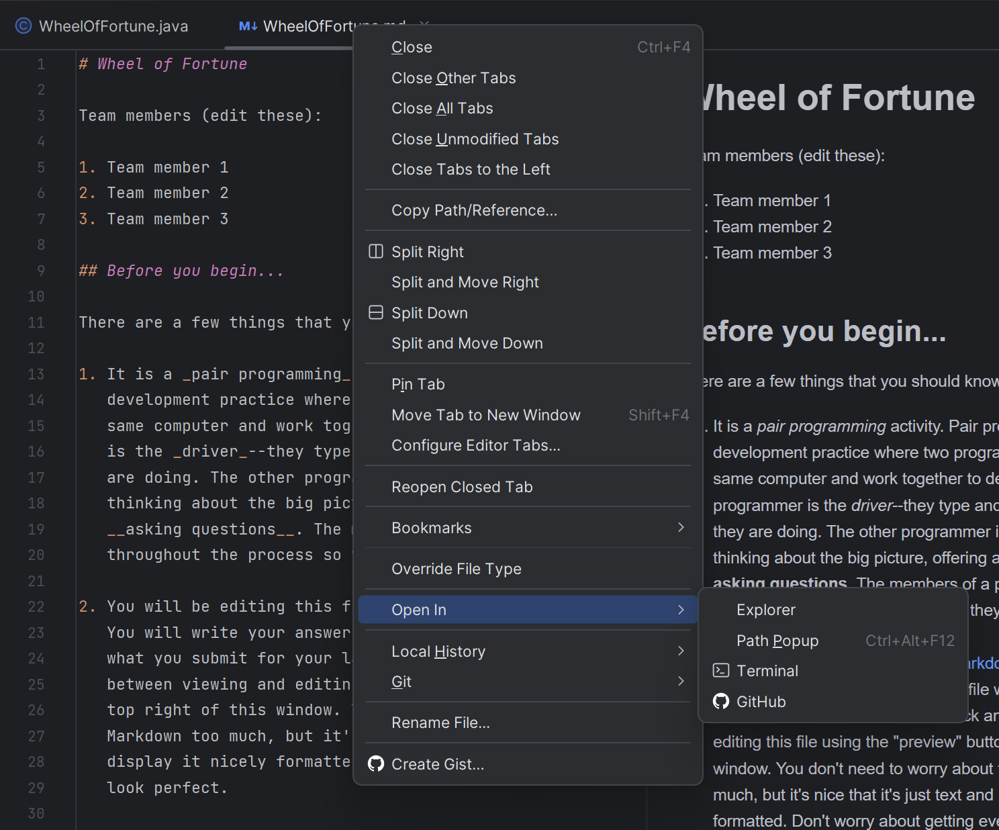

# CS 142 Lab 1

## Welcome to lab!

Welcome to the lab section of COMP 142-today, we'll be focusing primarily on a group programming assignment (detailed below!).  I'll have the list of partners up on the screen for this lab. Don't worry if you don't know someone's name; we're all still learning about each other! This webpage should give you a good breakdown of what to expect from this lab.  Remember that **both partners** need to submit all assignment files! I expect that everything will be finished on the day of the lab but as extra generosity (and to account for anything that might come up) the lab is **due by Friday at 5:00 PM.**

As a reminder, 15% of your lab grade is based on coming to the lab on time and working throughout the class period. If you're more than 5 minutes late or don't fully participate in the assignment, the highest grade you can make on the lab will be 85%. Make sure to budget enough time to get to class; being overly late to lab is disrespectful to your team and classmates and can cause disruption.  If you're not able to make it to class or have a conflict that causes you to run late, please let me know; as mentioned in the syllabus, policies on absences/grades emphasize communicating with me early and coming up with a plan.  

If your partner hasn't arrived by the five-minute cutoff period and hasn't communicated, I will pair you with a new partner or group.

If you ever have any questions, please ask me; this lab period is a way for me to provide quick feedback and answer your questions while you're programming.  If you finish the lab early, you're allowed to leave during the lab period as well.  

I know you have experience with our half-lab half-lecture class from last week, but this is the first time you'll be doing graded work as part of your lab!  Throughout this lab and this class, please let me know if you have any questions-and happy coding!!

## Wheel of Fortune


- Start IntelliJ. In the top-left corner of the screen, click the project dropdown and choose “Get from VCS.” This is the same approach we used earlier for in-class work. We will make a new project to store all of our labs and code that I want to distribute to the whole class.  (This will copy my code from online into a new project-I recommend you put this in a directory with the other COMP 142 projects. Intellij *should* automatically set this to the directory you've used most recently.)

- On the next screen, copy and paste in the following URL in the box that says “URL”:

  https://github.com/ncp38/cs142-s24-inclass


-  In the “Directory” box, double-check that the folder listed is the right place for new projects to be stored (a subfolder 
of your main cs142 projects). If something is off, you can click the folder icon at the far right of the text area and make 
a new folder for this class work.


- In the left-hand panel, expand the `src` folder to see today’s lab (in the lab1 folder). Double-click on 
  WheelOfFortune (not the md file yet.) If you get a message at the top that says “Project JDK is not defined,” then click on “Setup SDK” and choose the JDK you downloaded earlier.

- In the left-hand panel, double-click on `WheelOfFortune.md`. Follow the instructions in this file. This is where you will answer the questions for the lab.

## Submitting the lab

At the end of the lab session, upload the two files to canvas.  *Important!*  **You and your partner** must submit both the **.java file and the question file.**  You can find these files by hovering over the file name 
in the top bar in IntelliJ and right-clicking (or ctrl+click for Macs) and selecting Open in -> Explorer (for Macs, you'll instead want to select Open in -> Finder).



-Each Java file you upload should include **a header with your name, course name and section, and your teammates' names**.  (Your names need to be listed in the questions.md file as well!)

-Beneath this header **include a short description of what you've changed** in the file.

For example:

```java
//Lab 1 - Wheel of Fortune
//John Doe, COMP 142 Section 1
//Jane Deere, COMP 142 Section 1
//Changed lines 250-265 to allow the user to bet their earned money on a letter.
```